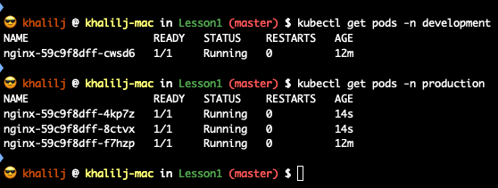

# Lesson 1 HomeWork
1. Write a YAML file that defined the following:
2. Namespace called development
3. Namespace called production
4. Deploy an nginx deployment with 1 replica to development namespace
5. Deploy an nginx deployment with 3 replica to production namespace

What to send me?
1. yaml file
    - see yaml files
2. screenshot of kubectl get pods -n development

    