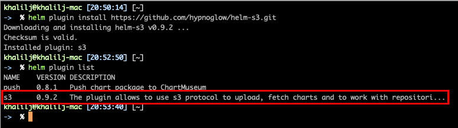
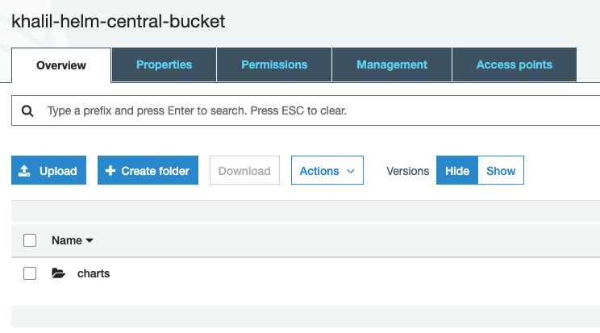
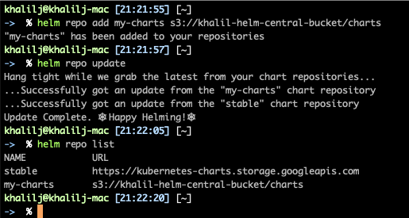
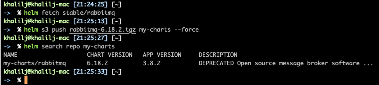
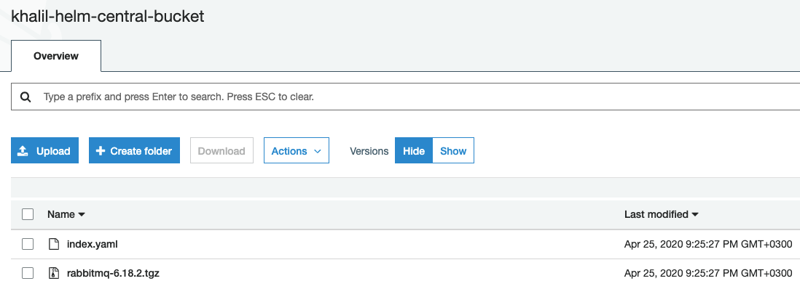
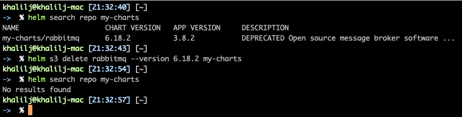

## Bonus - Q3

Install helm S3 plugin:
- ```helm plugin install https://github.com/hypnoglow/helm-s3.git```


Create the bucket:
    - ```cd cd BONUS/Q3/projects/my-bucket```
    - ```terraform init```
    - ```terraform apply --auto-approve```


Add S3 bucket as helm repo:
- ```helm repo add my-charts s3://khalil-helm-central-bucket/charts```
- ```helm repo update```
- ```helm repo list```

    
Pull helm chart and push it to S3 bucket:
1. ```helm fetch stable/rabbitmq```
2. ```helm s3 push rabbitmq-6.18.2.tgz my-charts --force```
3. ```helm search repo my-charts```





Delete chart from helm S3:
1. list charts by running: ```helm search repo my-charts```
2. Delete by running: ```helm s3 delete rabbitmq --version 6.18.2 my-charts```



Delete Helm S3 Repo:
- Run: ```helm repo remove my-charts```

Delete Se Bucket:
- Run: ```terraform destroy --auto-approve```
