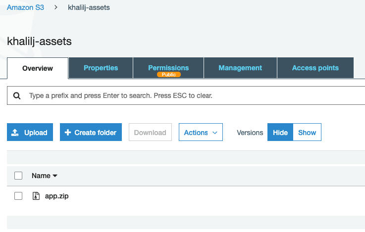
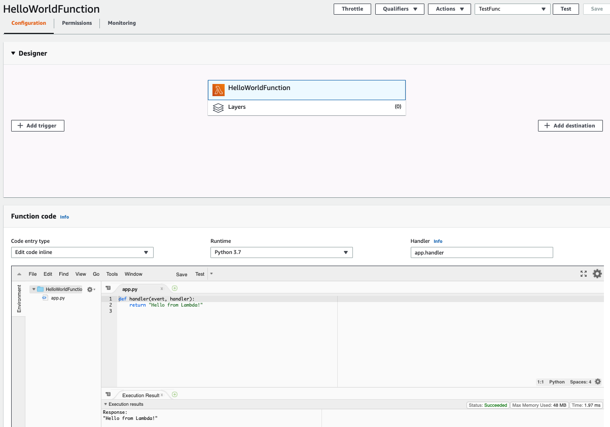

## Q1

**Commands:**
- ```cd Lesson11/Q1/projects/lambda-s3/```
- ```terrafrom init```
- ```terrafrom plan```
- ```terrafrom apply --auto-approve```
    
**Clean:**
- ```terraform destroy --auto-approve```






