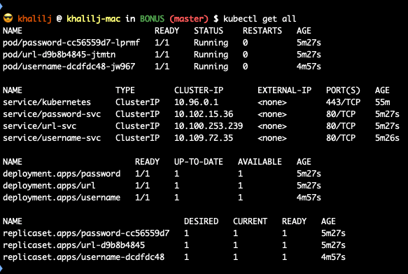
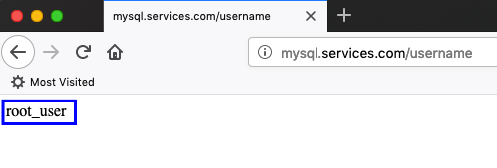
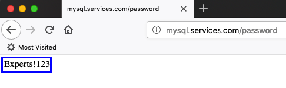
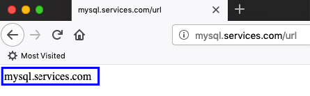

## Lesson 3 - Bonus


### Run on K8S
* Get minikube ip by running ```minikube ip```
* ```sudo vim /etc/hosts```
* Add to the end of the file: ```<minikube ip> mysql.services.com```
* ```minikube addons enable ingress```
* ```kubectl apply -f ./```
* open browser and navigate to:
    * mysql.services.com/username
    * mysql.services.com/password
    * mysql.services.com/url
    




