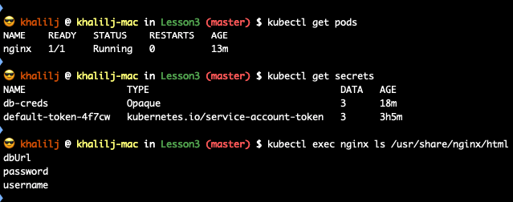

# Lesson 3 HomeWork

## Exercise

1. Write a YAML file thar define a secret named "db-creds" representing database conection. A database connection is composed of the following:

   - Username - root_user
   - Password - Experts!123
   - Database URL - mysql.services.com

2. Write a Yaml file that deploys an Nginx pod that mounts those secrets under /usr/share/nginx/html in the Nginx container.

3. BONUS: Split the Nginx pod to be constucted from 3 different pods, each one of them mounts a spesific secret from the secret and expose those with ingress as follows:
   - mysql.services.com/username
   - mysql.services.com/password
   - mysql.services.com/url

## Solution:

**Q1 + Q2**

- **Files**: **db-secret.yaml** & **nginx-pod.yaml**

- **How to run and check:**
  - Apply secret
    - `kubectl apply -f db-secret.yaml`
  - Apply Nginx
    - `kubectl apply -f nginx-pod.yaml`
  - Check Pod status and make sure it's Running
    - `kubectl get pods`
  - Check that creds mounted under /usr/share/nginx/html
    - `kubectl exec nginx ls /usr/share/nginx/html`

