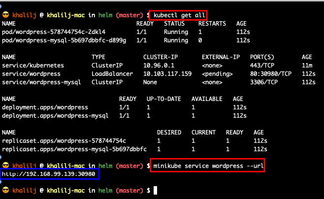
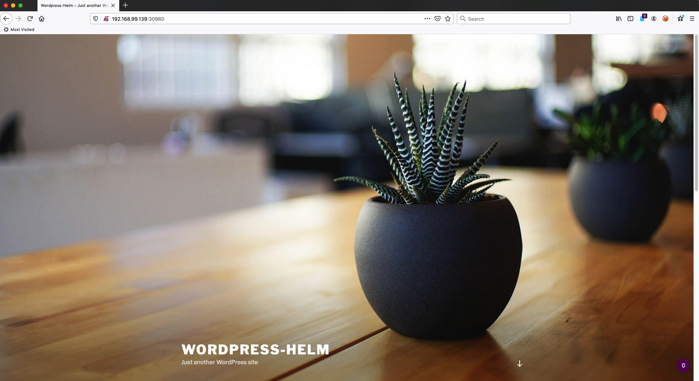
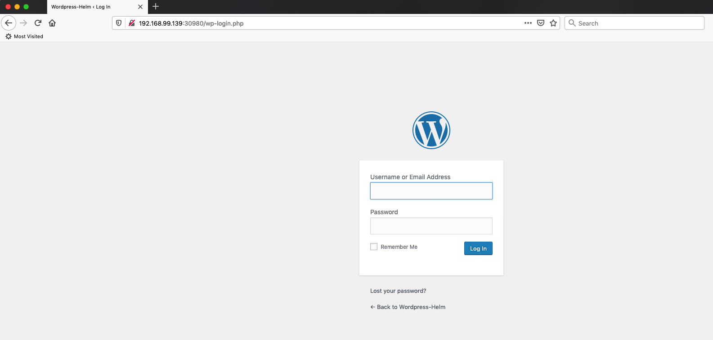

# Wordpress - Helm

## Commands:
* Install WordPress
    * ```helm install wordpress ./wordpress```
* Get application URL:
    * ```minikube service wordpress --url```
    

## Screenshots:






