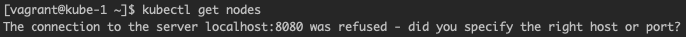
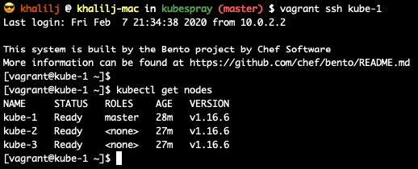

# Kubespray

After running the commands and trying to check if K8S installed successfully, I ran the command
```kubectl get all``` but received the following error:



After googling the error, I managed to solve it by running the following commands in **kube-1** machine:
```shell script
sudo cp /etc/kubernetes/admin.conf $HOME/
sudo chown $(id -u):$(id -g) $HOME/admin.conf
echo export "KUBECONFIG=$HOME/admin.conf" >> ~/.bash_profile
```



**P.S.**

I changed the IP and name of the machines in the **Vagrantfile** and in the **test_env/inventory.ini** 