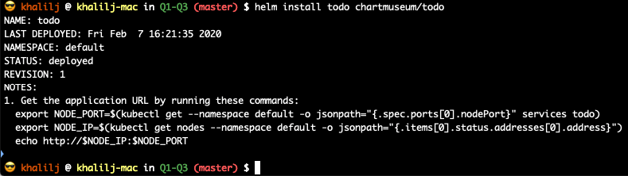
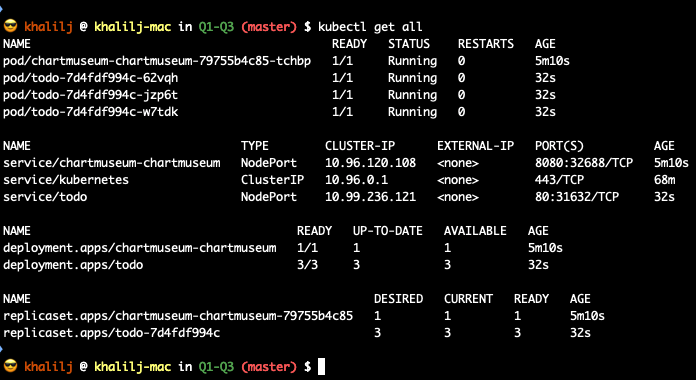
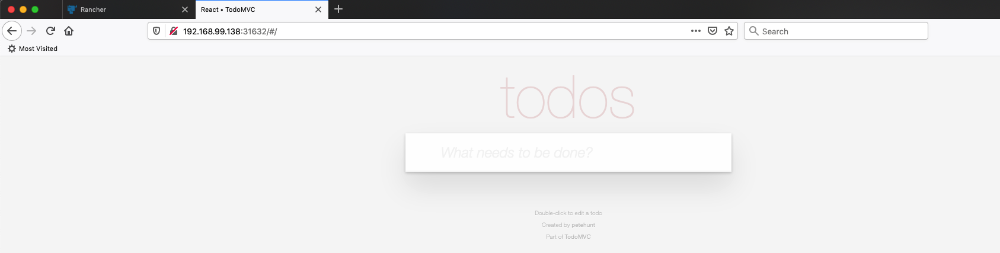

# Helm - TODO APP

### Commands:

1. ```helm create todo```
2. Edited the following in file **values.yaml**
```yaml
replicaCount: 3

image:
  repository: avielb/todo

service:
  type: NodePort
```
3. Edited the following in file **Chart.yaml**
```yaml
appVersion: latest
```
4. Validated yamls: ```helm install todo ./todo --dry-run --debug```
5. Pushed todo to chart museum repo: ```helm push todo/ chartmuseum```
6. Updated helm repo: ```helm repo update```
5. Installed todo: ```helm install todo chartmuseum/todo```








