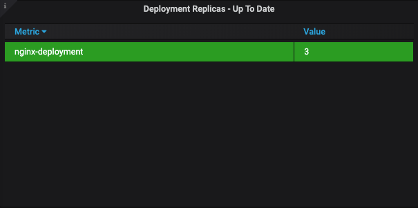
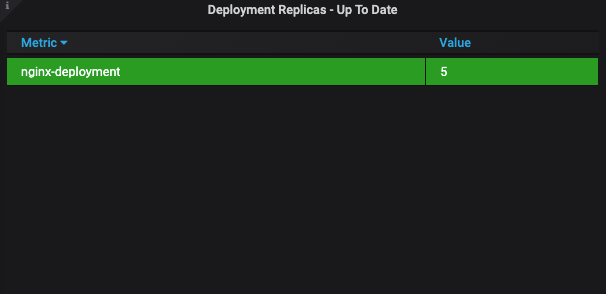
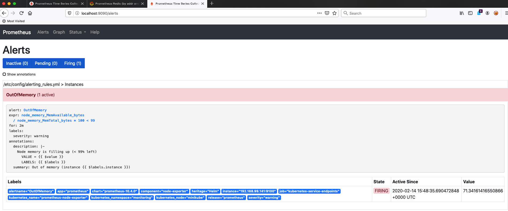
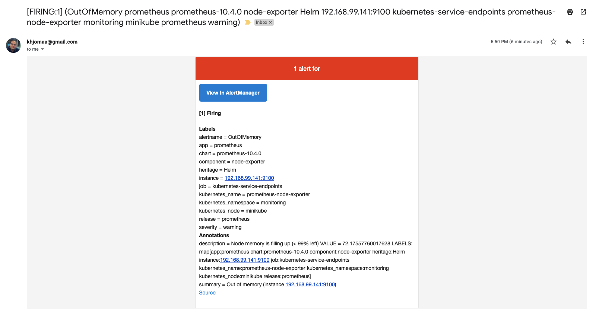

### BONUS

- Added to Grafana, dashboard number: [11663](https://grafana.com/grafana/dashboards/11663)
- Created **nginx-deployment.yaml** file with 3 replicas and apply it

nginx-deployment.yaml
```yaml
apiVersion: apps/v1
kind: Deployment
metadata:
  name: nginx-deployment
  labels:
    app: nginx
spec:
  replicas: 3
  selector:
    matchLabels:
      app: nginx
  template:
    metadata:
      labels:
        app: nginx
    spec:
      containers:
        - name: nginx
          image: nginx
          ports:
            - containerPort: 80
```

```shell script
kubectl apply -f nginx-deployment.yaml
```



After 2 min scaled the number of replicas to 5
```shell script
kubectl scale deploy nginx-deployment --replicas=5
```



- Configure mail alert
    - added my mail settings on values.yaml file (see file)
    - Ran the command: 
        ```shell script
        helm upgrade prometheus stable/prometheus --namespace monitoring -f values.yaml
        ```
    




