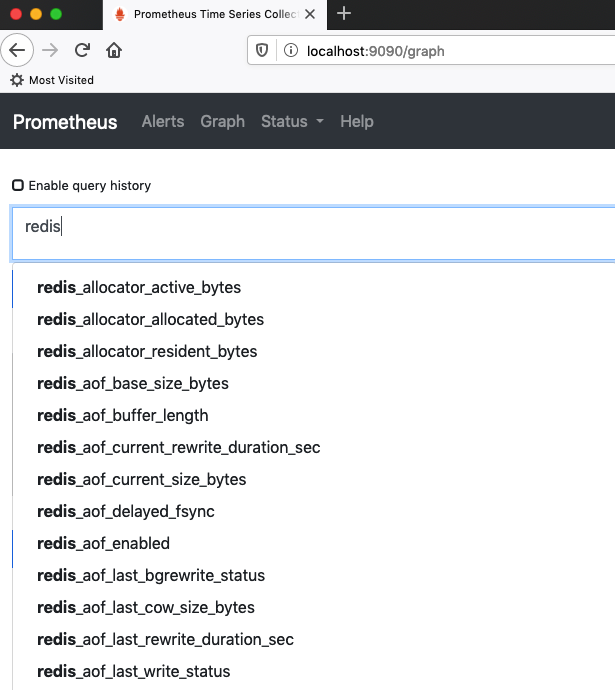
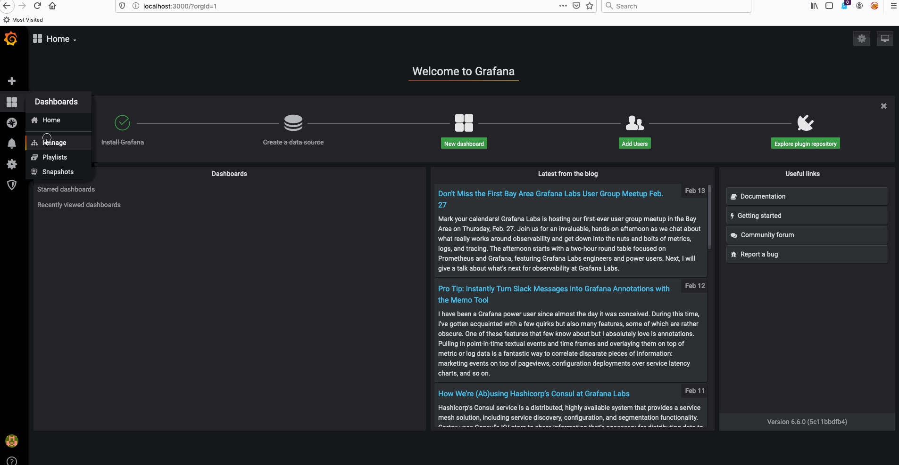

### Q1
- Redis Helm chart: https://github.com/helm/charts/tree/master/stable/redis
- Install Redis with metrics: ```helm install redis stable/redis --set metrics.enabled=true```
- Redis Notes:
```shell script
NAME: redis
LAST DEPLOYED: Fri Feb 14 12:11:49 2020
NAMESPACE: default
STATUS: deployed
REVISION: 1
TEST SUITE: None
NOTES:
** Please be patient while the chart is being deployed **
Redis can be accessed via port 6379 on the following DNS names from within your cluster:

redis-master.default.svc.cluster.local for read/write operations
redis-slave.default.svc.cluster.local for read-only operations


To get your password run:

    export REDIS_PASSWORD=$(kubectl get secret --namespace default redis -o jsonpath="{.data.redis-password}" | base64 --decode)

To connect to your Redis server:

1. Run a Redis pod that you can use as a client:

   kubectl run --namespace default redis-client --rm --tty -i --restart='Never' \
    --env REDIS_PASSWORD=$REDIS_PASSWORD \
   --image docker.io/bitnami/redis:5.0.7-debian-10-r0 -- bash

2. Connect using the Redis CLI:
   redis-cli -h redis-master -a $REDIS_PASSWORD
   redis-cli -h redis-slave -a $REDIS_PASSWORD

To connect to your database from outside the cluster execute the following commands:

    kubectl port-forward --namespace default svc/redis-master 6379:6379 &
    redis-cli -h 127.0.0.1 -p 6379 -a $REDIS_PASSWORD
```
- Get pods: ```kubectl get pods```


- Redis metrics on Prometheus Server:



---

### Q2

Add Redis dashboard to Grafana

- URL: https://grafana.com/grafana/dashboards
- Search for Redis
- Choose for example: **Prometheus Redis (by addr and host) by Younes Ouadi**
- Copy the dashboard number - in our case it's **4074**
- Go to Granana
- Dashboards => Manage => Import
- Enter **4074** under Grafana.com dashboard
- Choose **Prometheus** as data source
- Click on Import



