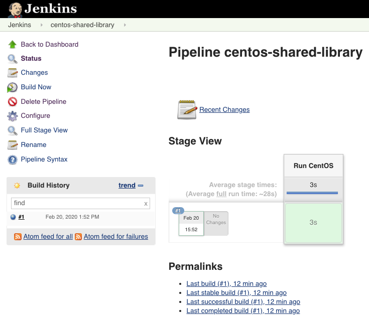
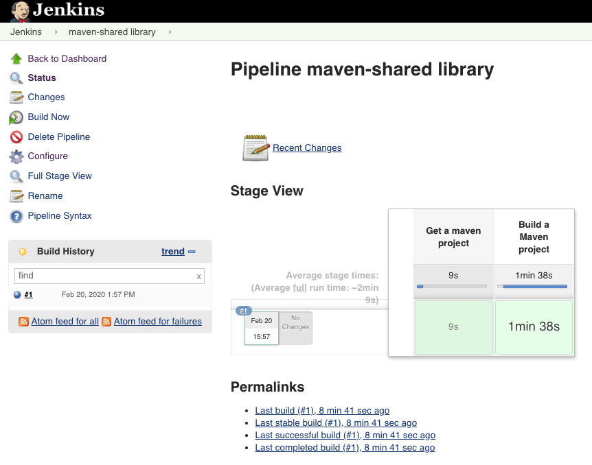

## BONUS

### Add Jenkins Shared Library
1. Go to Jenkins -> Manage Jenkins -> Configure System
2. Scroll down to "Global Pipeline Libraries"
3. Under Name write: jenkins-shared-library
4. Under "Default version" write: master
5. Under "Retrieval method" select "Modern SCM"
6. Under "Source Code Management" select "Git"
7. Under "Project Repository" enter "https://github.com/avielb/jenkins-shared-library.git"

---

### How to run:
1. Create new item of pipeline named "centos-shared-library"
2. Add to Pipeline Script the content of file **centos-shared-library.groovy**
3. Save and Build **(see BuildsLog/centos-shared-library.txt)**
4. Create another pipeline item names "maven-shared-library"
5. Add to Pipeline Script the content of file **maven-shared-library.groovy**
6. Save and Build **(see BuildsLog/maven-shared-library.txt)**

**centos-shared-library Build**

**maven-shared-library Build**

