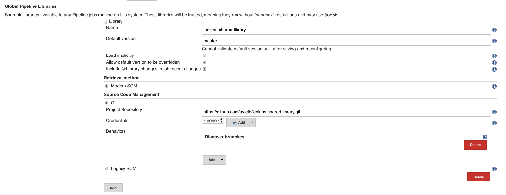
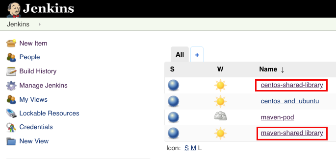

## BONUS

How to:
1. Go to Jenkins -> Manage Jenkins -> Configure System
2. Scroll down to "Global Pipeline Libraries"
3. Under Name write: jenkins-shared-library
4. Under "Default version" write: master
5. Under "Retrieval method" select "Modern SCM"
6. Under "Source Code Management" select "Git"
7. Under "Project Repository" enter "https://github.com/avielb/jenkins-shared-library.git"
8. Create a new pipeline and add to it the content of ***shared-library-pipeline.groovy** file 

