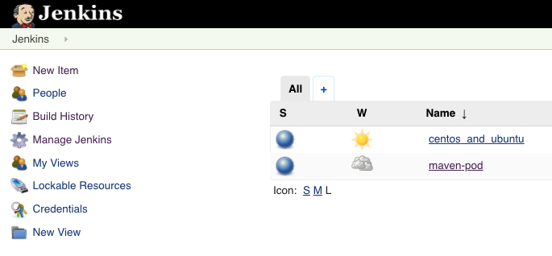

## Q1

1. **Start minikube** (run the following commands in **Terminal**)
    - ```minikube start --cpus 2 --memory 6144 --vm-driver virtualbox```
    - ```eval $(minikube docker-env)```
    - ```docker run -d -p 5000:5000 registry:latest```
2. **Install Jenkins**
    - ```helm install jenkins stable/jenkins```
    - Check if pod is READY and RUNNING by running: ```kubectl get pods```

**NOTES:**
1. Get your 'admin' user password by running:
    ```printf $(kubectl get secret --namespace default jenkins -o jsonpath="{.data.jenkins-admin-password}" | base64 --decode);echo```
2. Get the Jenkins URL to visit by running these commands in the same shell:
  
    ```
   export POD_NAME=$(kubectl get pods --namespace default -l "app.kubernetes.io/component=jenkins-master" -l "app.kubernetes.io/instance=jenkins" -o jsonpath="{.items[0].metadata.name}")
   echo http://127.0.0.1:8080
   kubectl --namespace default port-forward $POD_NAME 8080:8080
   ```
   
   **OR**
   1. Run: ```kubectl port-forward svc/jenkins 8080:8080 &```
   2. Browse to: http://localhost:8080

3. Login with the password from step 1 and the username: admin

## Q2
Note: Details and example of using podTemplate can be found [here](https://jenkins.io/doc/pipeline/steps/kubernetes/#podtemplate-define-a-podtemplate-to-use-in-the-kubernetes-plugin) or [here](https://github.com/jenkinsci/kubernetes-plugin)

File: **centos_and_ubunto.groovy**

How to run it:
- Open Jenkins
- Click on **New Item**
- Enter name (e.g centos_and_ubuntu)
- Select **Pipeline**
- Click **OK**
- Scroll down to **Pipeline** section
- Make sure that for **Definition**, a **Pipeline script** is selected
- Copy the content of the file **centos_and_ubunto.groovy** and paste it on the **Script** section
- Click **Save**
- Click **Build Now**

## Q3

File: **maven.groovy**

How to run it:
- Open Jenkins
- Click on **New Item**
- Enter name (e.g maven-pod)
- Select **Pipeline**
- Click **OK**
- Scroll down to **Pipeline** section
- Make sure that for **Definition**, a **Pipeline script** is selected
- Copy the content of the file **maven.groovy** and paste it on the **Script** section
- Click **Save**
- Click **Build Now**

---



