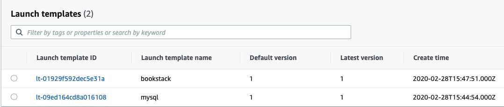
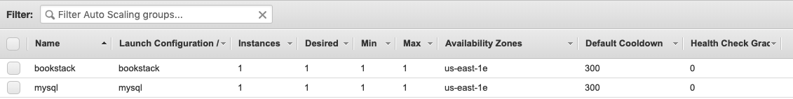
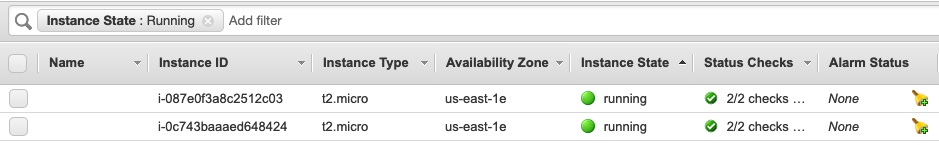

## BONUS

Useful docs:
- [create-launch-template](https://docs.aws.amazon.com/cli/latest/reference/ec2/create-launch-template.html)
- [create-auto-scaling-group](https://docs.aws.amazon.com/cli/latest/reference/autoscaling/create-auto-scaling-group.html)

### Mysql
- Create launch template
    ```
    aws ec2 create-launch-template \
        --launch-template-name mysql \
        --launch-template-data file://mysql-config.json
    ```

- Create auto scaling group
    ```
    aws autoscaling create-auto-scaling-group \
        --auto-scaling-group-name mysql \
        --launch-template "LaunchTemplateName=mysql" \
        --min-size 1 \
        --max-size 1 \
        --availability-zones us-east-1e
    ```
### Bookstack
- Create launch template
    ```
    aws ec2 create-launch-template \
        --launch-template-name bookstack \
        --launch-template-data file://bookstack-config.json
    ```

- Create auto scaling group
    ```
    aws autoscaling create-auto-scaling-group \
        --auto-scaling-group-name bookstack \
        --launch-template "LaunchTemplateName=bookstack" \
        --min-size 1 \
        --max-size 1 \
        --availability-zones us-east-1e
    ```    

### Security Groups (allow ports 3306 & 8080 for default group)
- Port 8080
    ```
    aws ec2 authorize-security-group-ingress \
        --group-name default \
        --protocol tcp \
        --port 8080 \
        --cidr 0.0.0.0/0
    ```   
- Port 3306
    ```
    aws ec2 authorize-security-group-ingress \
        --group-name default \
        --protocol tcp \
        --port 3306 \
        --cidr 0.0.0.0/0
    ```

---

Launch Templates


Auto Scaling Groups


Instances



