## Q1 - Q3

### How to:

#### Q1 : Create **Launch Templates**
1. Sign In to the [AWS Management Console](https://console.aws.amazon.com/console/home?nc2=h_ct&src=header-signin)
2. Click on **EC2** service
3. Expand **INSTANCES** on the left panel and click on **Launch Templates**

    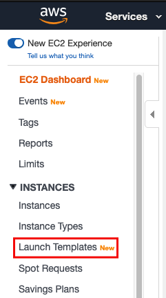
4. Click **Create launch template**
    
    
5. Define the following properties:
    - Template name: **bookstack**
    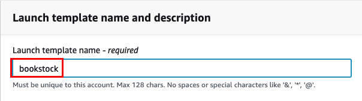
    - Amazon machine image (AMI): **Amazon Linux 2 AMI (HVM), SSD Volume type (ami-0a887e401f7654935)**
    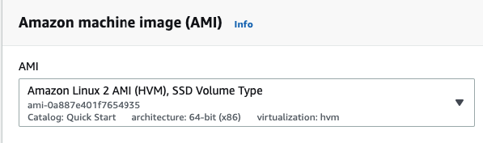
    - Instance type: **t2.micro**
    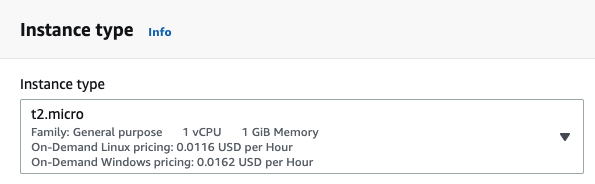
    - Network settings: Set "Security groups" to "default"
    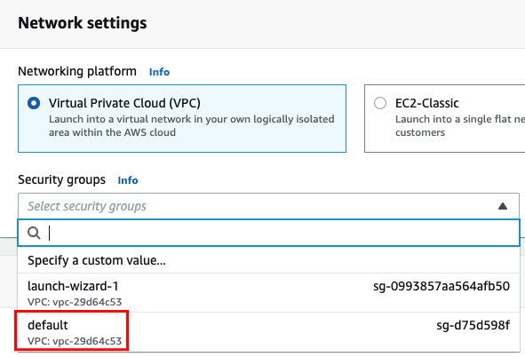
    - Advanced details: set "User data" to:
        ```shell script
        #!/usr/bin/bash
        yum install docker -y
        systemctl enable docker
        systemctl start docker
        docker network create bookstack_nw
        docker run -d --net bookstack_nw \
        -e MYSQL_ROOT_PASSWORD=secret \
        -e MYSQL_DATABASE=bookstack \
        -e MYSQL_USER=bookstack \
        -e MYSQL_PASSWORD=secret \
        --name="bookstack_db" \
        mysql:5.7.21
        docker run -d --net bookstack_nw \
        -e DB_HOST=bookstack_db:3306 \
        -e DB_DATABASE=bookstack \
        -e DB_USERNAME=bookstack \
        -e DB_PASSWORD=secret \
        -p 8080:80 \
        solidnerd/bookstack:0.27.5
        ```
        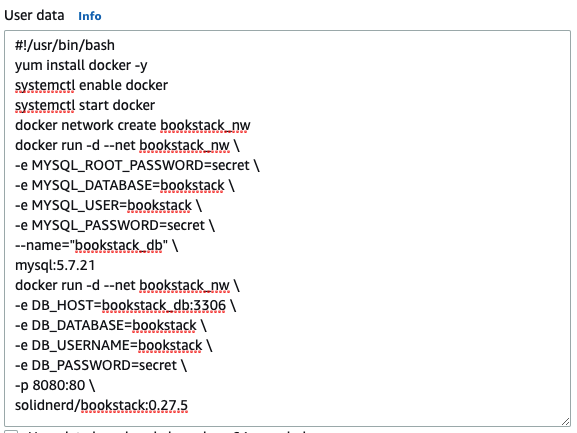
6. Click **Create launch template**
 
    
7. Click **View launch template**

    
8. You should get the following screen:
    
    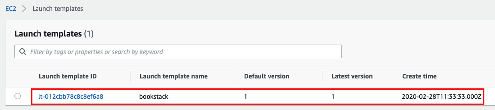
---

#### Q2 : Create **Auto Scaling Groups**
1. Expand **AUTO SCALING** on the left panel and click on **Auto Scaling Groups**
    
    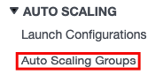
2. Click **Create Auto Scaling group**

    
3. Select **Launch Template**

    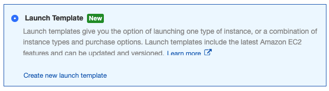
4. Select the **bookstack** template
    
    
5. Click **Next Step**
    
    
6. Define the following:
    - Group name: **bookstack**
    - Launch Template Version: **1 (Default)**
    - Subnet: choose 1
    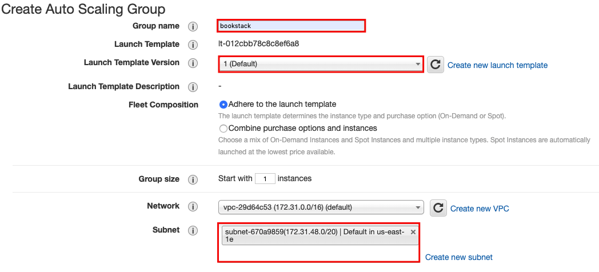
7. Click **Next: Configure scaling policies**
    
    
8. Click **Next: Configure Notifications**
   
    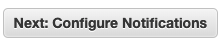
9. Click **Next: Configure Tags**
    
    
10. Click **Review**
    
    
11. Click **Create Auto Scaling group**
    
    

12. You should get the following message:
    
    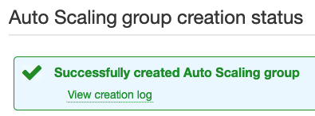

---

#### Q3 : Create **Define ingress rule to allow connections on port 8080 from anywhere in the default security group**
1. Expand **INSTANCES** on the left panel and click on **Instances**
    
    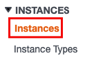
2. Select the instance
3. Under the **Description** tab click on **default** next to **Security groups**
    
4. Click **Edit**
    
    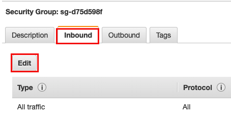
5. Edit the rule as the following:
    - Type: Custom TCP
    - Port Range: 8080
    - Source: Anywhere
6. Click **Save**
    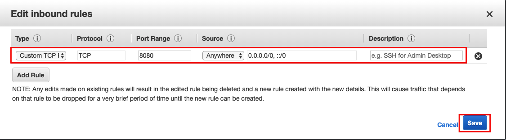

---

#### **Validate**
1. Copy instance **Public DNS (IPv4)** or **IPv4 Public IP**
2. Open browser and navigate to <Public DNS / IP>:8080
3. You should get the login page
4. User: **admin@admin.com**, Password: **password**

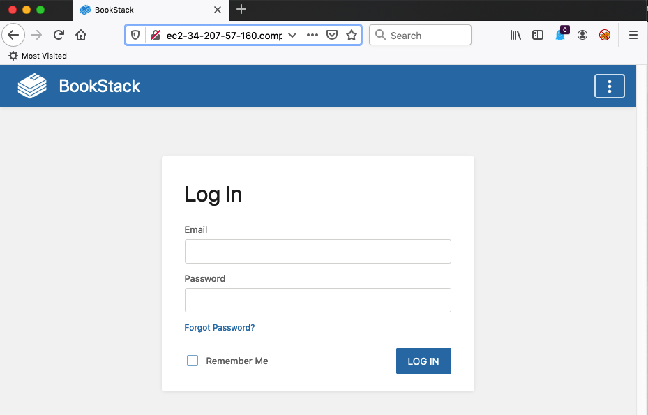

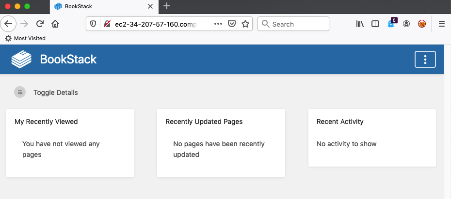

 