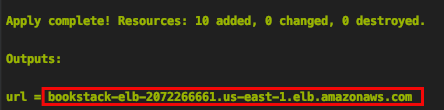
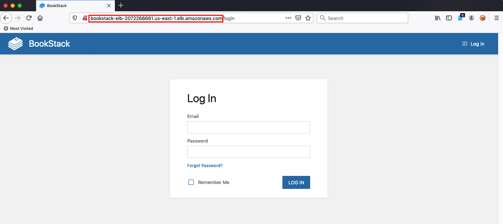

## BONUS

**Commands**:
- ```cd BONUS/projects/bookstack/```
- ```terraform init```
- ```terraform plan```
- ```terraform apply```

**Check:**
- Wait until instance fully initialize
- Copy LoadBalancer url from outputs
    
- Browse to LB url
- Credentials:
    - Email: admin@admin.com
    - Password: password


**Clean**:
- ```terraform destroy --auto-approve```